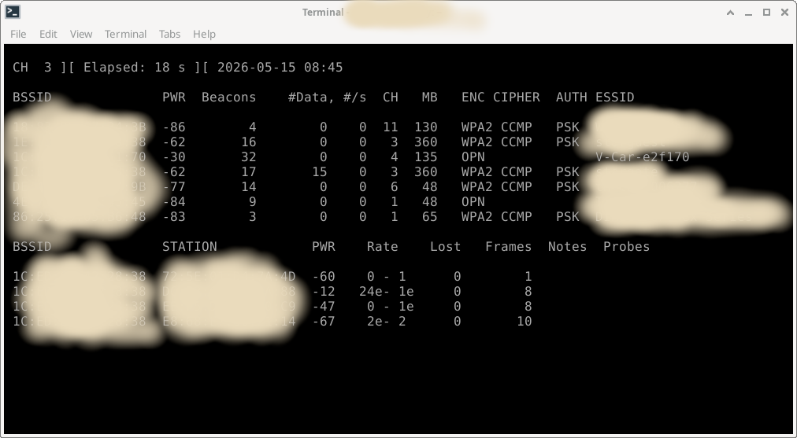

# qcar
An open source implementation of the protocol used in the f-car app

## Where is the official App?

I bought an cheap Mini-HD Wifi RearView Camera years ago. There was an app for this, available within the PlayStore, back in that time. Switching to a new phone recently, I noticed that the app was gone.

As I never was a fan of that app, and also want to use this cam with an open source mobile linux distro, I started to look at his cams protocol to use it with an alternative app.

The cam spans its own wifi network: V-Car-e2f170
```console
> airmon-ng start wlan0
> airodump-ng wlan0mon
```console




