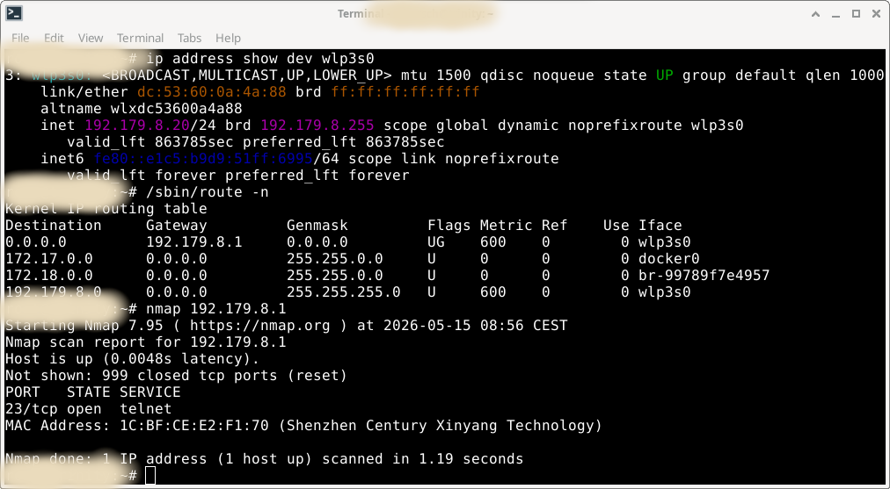
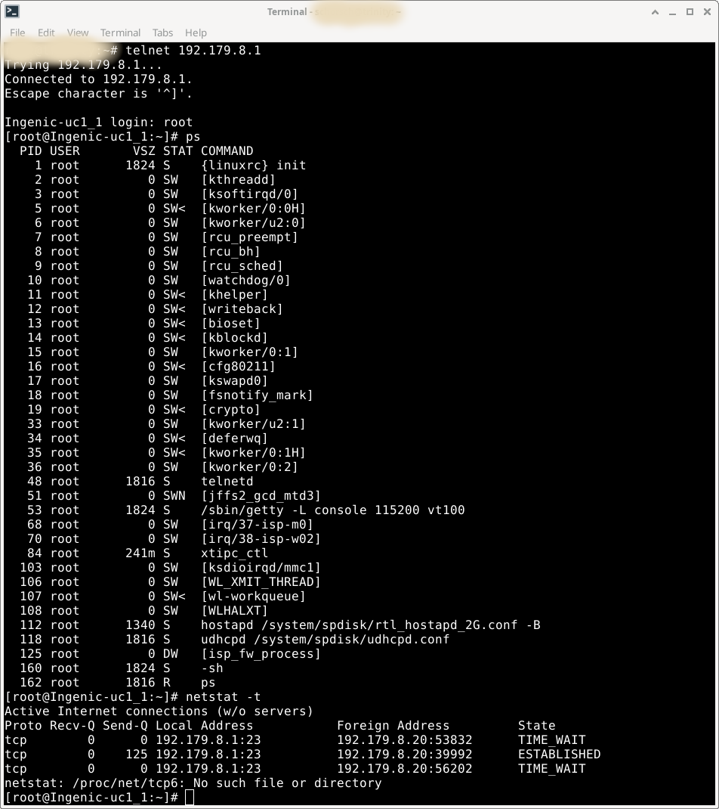
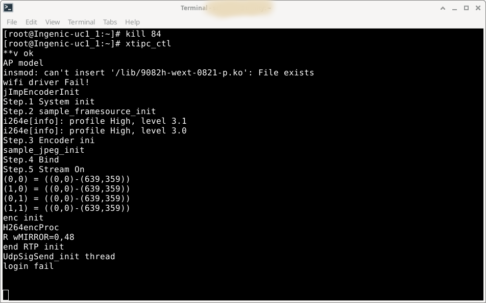
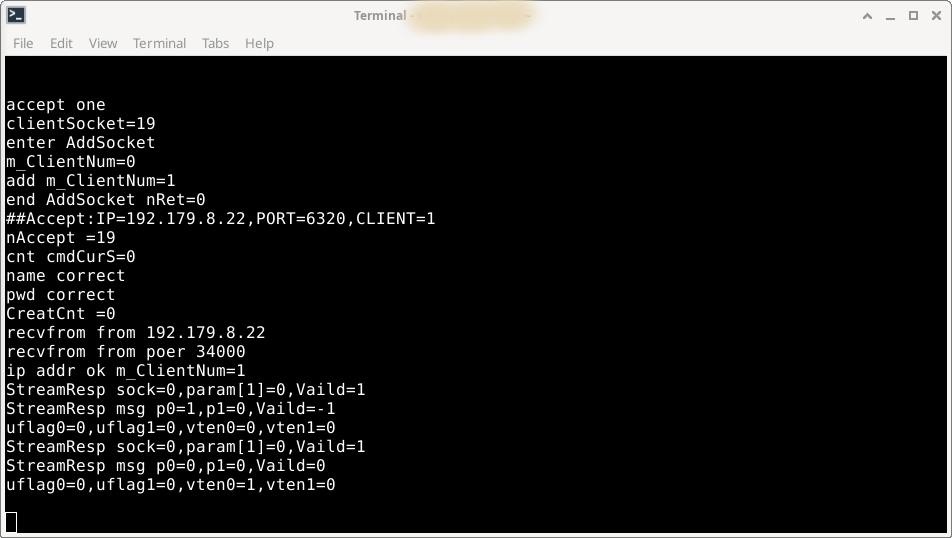
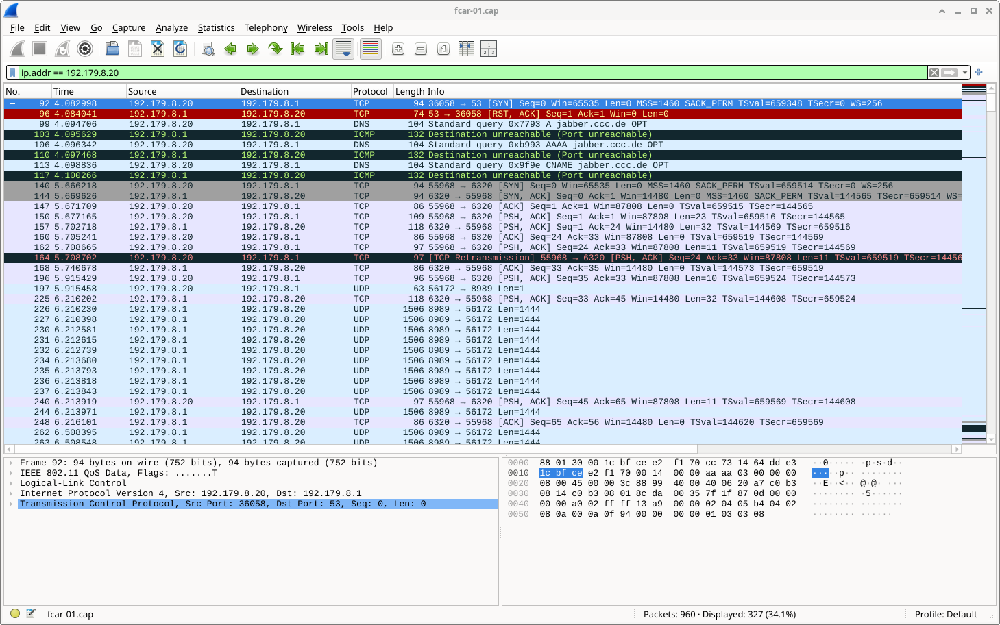
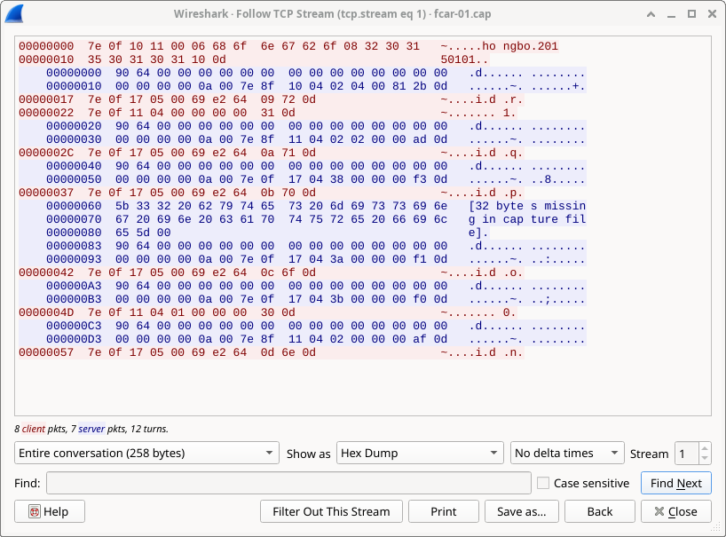
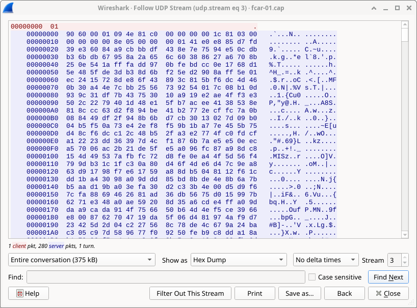
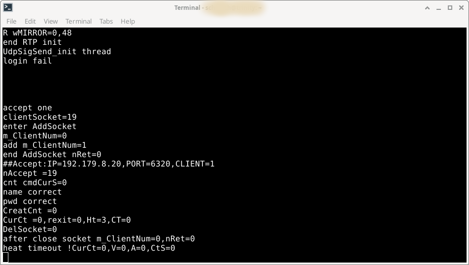

# qcar
An open source implementation of the protocol used in the f-car app

## Where is the official App?

I bought an cheap Mini-HD Wifi RearView Camera years ago. There was an app for this, available within the PlayStore, back in that time. Switching to a new phone recently, I noticed that the app was gone.

As I never was a fan of that app, and also want to use this cam with an open source mobile linux distro, I started to look at his cams protocol to use it with an alternative app.

The cam spans its own wifi network: V-Car-e2f170
```console
> airmon-ng start wlan0
> airodump-ng wlan0mon
```


As you can see, this is an open wifi access point. So, just associate to it and have deeper look:



There is an open telnet port. Just try to connect to it:



That was easy. They probably did not try to hide and make it complicated. The telnetd just expects root as a login name with no password. Perfect to do some reverse engineering with the system. Worst scenario from a security point of view.

Looking at the system, this is a quite basic embedded linux environment. Just a kernel with a busy box. Telnetd is running and a getty. Hosapd is used for the access point and udhcpc to assign the network configuration to the wifi clients. 
The only custom application is xtipc_ctl. So, lets kill it and check if the engineer left some debug output for us:



Already something useful.
Some init stuff, some stuff about h264 and jpeg. Seems to be the correct app, which handles the cam stream.

Try to connect with the old smartphone and the official app:



Looks quite easy. 

The app accepts the connection from the mobile device, check a name and a password. Then receives something from it and starts streaming.

But which name, which password? What to send?

As this is an open wifi connection, with no security at all, lets have a look at the network traffic. Do some capturing while connecting to the cam with the official app:

> airodump-ng --bssid 1C:BF:CE:E2:F1:70 -c 4 -w /tmp/fcar.pcap wlan0mon

And analyze it with wireshark, filtering on the ip address:



The interesting part are the TCP and UDP packets. Lets have a look at the TCP stream first.



Looking at this stream, the first printable characters could look like the username and password. All the hex bytes sent (red), starts and stops with the same content. That could be magic bytes of a protocol. The content between that bytes somehow changes. 

The very first sequences are special. They are probably used for authenticating and configuration.
The very last sequence maybe is the closing of the stream.
The sequence in between only changes by one byte. That could be a kind of hearbeat.

Now, lets look at the UDP stream:



Just one byte (red) is sent to the cam. Then the UDP stream starts and continuous. This is probably the raw camera stream.

So, lets wrap up the assumptions:

    * TCP is used to 
        + login
        + configure the camera stream
        + send continuous heartbeat
    * UDP is used to
        + start stream
        + receive camera stream

With this in mind, try to prove the assumption and send the caputred login sequence to the camera while looking at the app debug output:

> echo "7e 0f 10 11 00 06 68 6f 6e 67 62 6f 08 32 30 31 35 30 31 30 31 10 0d" | xxd -r -p | nc -v -w 2 192.179.8.1 6320



This already works great. The debug output at the cam shows the accepted login. But the stream did not start yet.

Time to generate a python PoC which sends the captured TCP sequences for login, configuration and heartbeat. And also sends the UDP start stream command to receive the actual camera stream.

The PoC will capture the UDP stream and forward it to mpv to display the actual camera content. 

It turns out that the UDP stream is not just clean h264, but needs some filtering. The PoC does this just by removing some proprietary stuff at the start of each sequence. But this needs to be improved...


